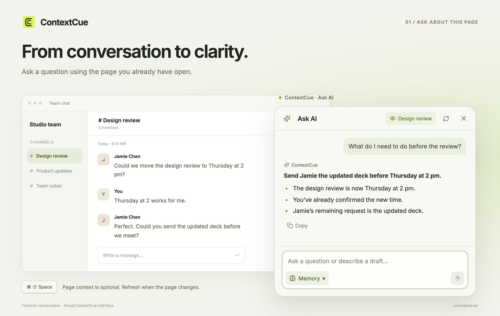
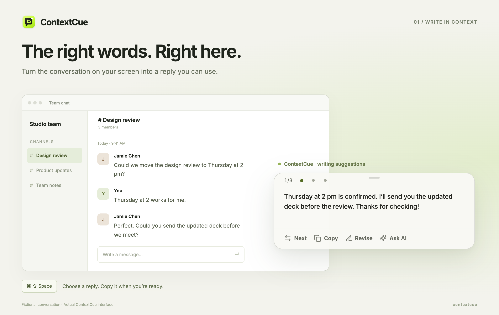
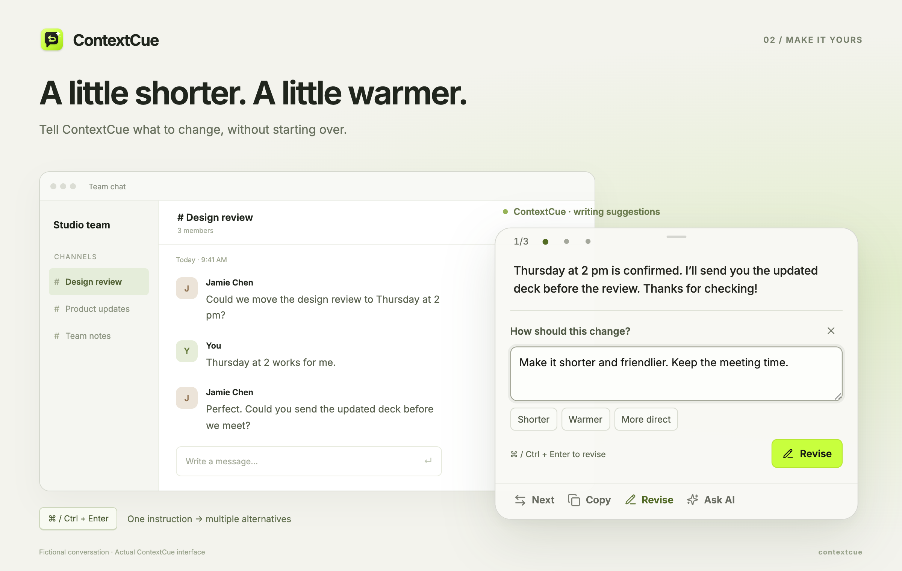
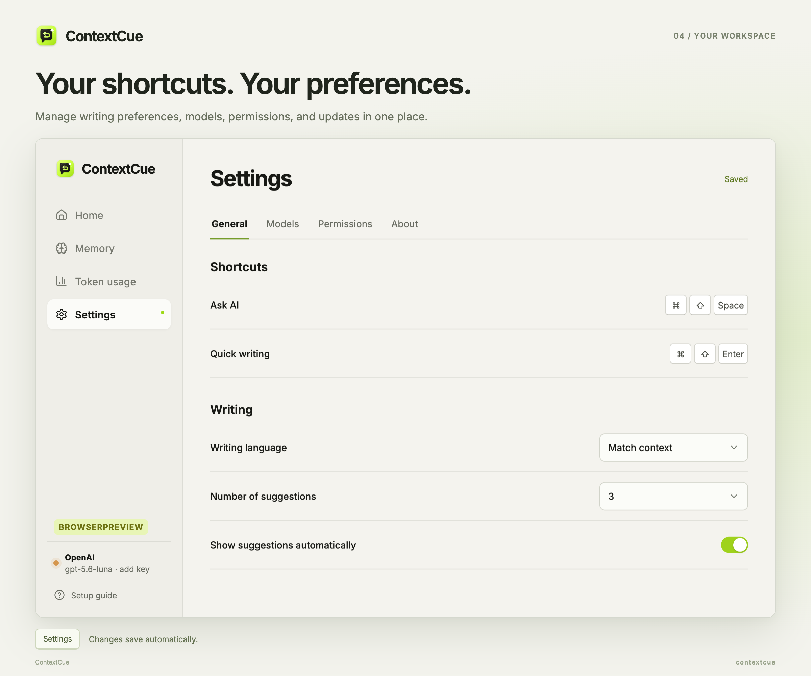

<div align="center">
  
  <h1>ContextCue</h1>
  <p><strong>Ask about your screen. Turn ideas into drafts.</strong></p>
  <p>One floating assistant for understanding a page, drafting a reply, and finding the right words.</p>
  <p>
    <a href="https://github.com/jastfkjg/ContextCue/releases">Download for macOS</a>
    · <a href="#quick-start">Quick start</a>
    · <a href="./README.zh-CN.md">简体中文</a>
  </p>
  <p><strong>One shortcut</strong> · Your model provider · You decide what to send</p>
</div>



Press a shortcut to open **Ask AI** over the window you’re using. Ask “What do I need to do here?” or say “Draft a polite decline, leaving the door open.” Read explanations directly; writing requests become drafts you can revise, copy, or insert. A separate shortcut takes you straight to writing suggestions.

## What you can do

| When you need to… | ContextCue helps you… |
|---|---|
| **Understand a page** | Ask for a summary, explanation, or next steps in a compact AI conversation, with optional page context. |
| **Turn intent into a draft** | Say what you want to communicate in Ask AI. Writing requests open reply candidates you can revise, copy, or insert. |
| **Find the right tone** | Revise a selected draft while keeping it in view. Compare alternatives, then return to the same Ask AI conversation. |
| **Write beyond chat** | Draft text, rewrite a passage, complete a field, or compose a search query. |
| **Use your own model** | Connect an image-capable model through a Responses or Chat Completions endpoint; keep multiple configurations. |
| **Stay in control** | Review before copying or inserting. See provider-reported token usage locally. Nothing is sent or submitted automatically. |

Works from app and browser windows without a per-app integration. On macOS, recognized text fields support insertion; copying is available when insertion is not supported. Search assistance drafts queries; it does not browse the web.

## Quick start

### 1. Install or run locally

**macOS:** Open [Releases](https://github.com/jastfkjg/ContextCue/releases), download the DMG for **Apple Silicon (`arm64`)** or **Intel (`x64`)**, and move ContextCue to Applications. Check the release notes for signing and first-launch instructions; early-access builds may not be notarized.

**From source:** Requires **Node.js 22.12+** and **npm 10+**.

```bash
git clone https://github.com/jastfkjg/ContextCue.git
cd ContextCue
npm install
npm run dev
```

macOS is the primary verified platform. Windows and Linux can run from source; Linux capture requires X11 and `xdotool`. Cross-app insertion is currently macOS-only.

### 2. Connect a model

The **Setup guide** walks you through adding a model and API key, verifying image input, checking screen access, and asking about or drafting a reply to a fictional conversation. macOS Accessibility permission is optional and enables insertion into supported fields.

Manage connections in **Settings → Models**; complete the required fields and changes save automatically. Use a model that supports **image input** for suggestions and page-aware questions. Text-only models work for questions, drafts, and subsequent draft revisions in **Ask AI** when page context is off. Model requests, including setup verification, may incur provider charges. [Provider and environment configuration →](./docs/guide.md#model-providers)

Check screen recording and optional insertion access in **Settings → Permissions**. Expand **Test window capture**, start the test, and switch to your target window within three seconds. Return to Settings to inspect the local preview.

### 3. Open a window and call ContextCue

| Action | macOS | Windows / Linux |
|---|---|---|
| Open Ask AI (main entry) | `⌘ ⇧ Space` | `Ctrl ⇧ Space` |
| Generate writing suggestions directly | `⌘ ⇧ Enter` | `Ctrl ⇧ Enter` |
| Send an Ask AI question / add a newline | `Enter` / `Shift Enter` | `Enter` / `Shift Enter` |
| Switch suggestions | `←` / `→` | `←` / `→` |
| Apply the selected suggestion¹ | `Enter` | `Enter` |
| Submit revision instructions | `⌘ Enter` | `Ctrl Enter` |
| Close the composer or panel | `Esc` | `Esc` |

¹ Outside text inputs, with the revision composer closed. Inserts into a recognized macOS field, otherwise copies. It never sends the message. These are defaults for new installs; upgrades preserve existing shortcuts. Change shortcuts, writing language, and candidate count in **Settings → General**.

## See it in action

### From a question to a usable draft

Ask “What do I need to do before the review?” to understand the page. Then say “Draft a friendly reply confirming the time and promising to send the deck.” ContextCue opens writing candidates in the same floating window. Choose one, revise it, or return to **Ask AI** to continue the conversation. **Open draft** brings you back to the latest draft.



Use the page chip to toggle screenshot context, or the refresh button to capture the original window again and start a new conversation. Refresh clears old questions and drafts only after capture succeeds. Switching to another app temporarily hides the panel; returning to the original window restores your work. [Session and refresh details →](./docs/guide.md#how-it-works)

### Make a draft sound like you

Choose **Revise**, describe the change, and get fresh alternatives in the same panel. Start with **Shorter**, **Warmer**, or **More direct**, or write your own instruction. The draft and revision instructions scroll separately, so you can keep the text in view. **Collapse** folds the instructions away; the top-right **×** closes the window. You can switch back to the original suggestions.



### Set up your workspace

Home shows **Ask AI**, **Quick writing**, and model and screen-access status. Settings groups the controls into four tabs:

| Tab | What you can change |
|---|---|
| **General** | Record shortcuts, choose a writing language, and set the number of suggestions. |
| **Models** | Add model connections, test an endpoint, and choose the default. |
| **Permissions** | Check screen and insertion access; test capture and inspect available windows. |
| **About** | Check for updates and download a new version. |



Settings save automatically. **Writing language** controls generated text; **Match context** follows the language of the page. **Token usage** in the sidebar shows usage by model, daily trends, and recent requests.

## Your context, your choice

- **Capture on invocation.** ContextCue does not record your screen in the background. A new invocation or explicit refresh takes a new snapshot.
- **Your chosen provider.** Screenshots and relevant text are sent to the model endpoint you configure when used in a request. “Local-first” describes storage; inference may run remotely.
- **Local settings and history.** Settings, memory documents, and usage records are stored on your device. Relevant enabled notes can be shared with your model for writing and personalized questions; past accepted replies are never automatically reused. Ask AI has an independent Memory switch, and results show the notes shared. API keys are encrypted with OS-backed storage; the entire data file is not encrypted.
- **You approve the words.** Copy or insert explicitly. ContextCue never submits a form or sends a message for you. Screenshots are not automatically redacted.

[Privacy details](./docs/guide.md#privacy-boundaries) · [Platform and capture limitations](./docs/guide.md#current-limitations)

## Development and documentation

Built with **Electron, React, and TypeScript**.

```bash
npm run lint     # TypeScript validation
npm test         # Unit tests
npm run build    # Build the desktop app
npm run package  # Create an unpacked application
```

| Explore | Details |
|---|---|
| [User guide](./docs/guide.md) | Setup, model providers, local memory, token usage, architecture, and all development commands |
| [Interaction flows](./docs/interaction-flows.md) | Session boundaries, revisions, and acceptance checks |
| [Updates and releases](./docs/updates.md) | Packaging, signing, and in-app updates |
| [Roadmap](./TODO.md) | Current priorities and planned features |

ContextCue is an early desktop MVP. Found something that could work better? [Open an issue](https://github.com/jastfkjg/ContextCue/issues).

## License

ContextCue is licensed under the [MIT License](./LICENSE). Commercial use, modification, and redistribution are permitted, including in closed-source products, provided the copyright and permission notices are preserved. The software is provided without warranty.

Third-party dependencies and assets remain subject to their respective licenses, including the Inter font (SIL Open Font License 1.1).
