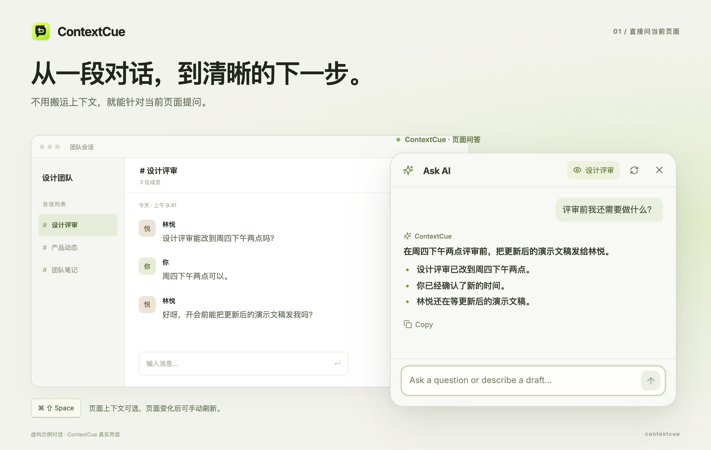
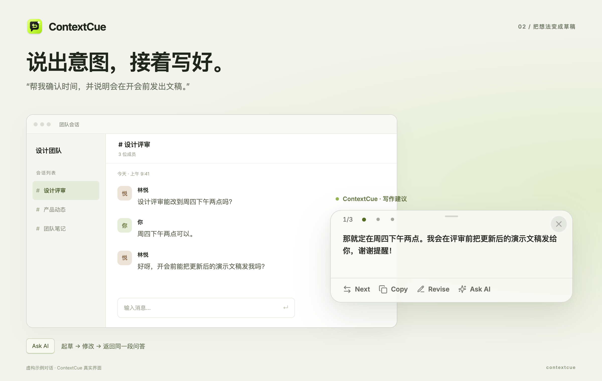
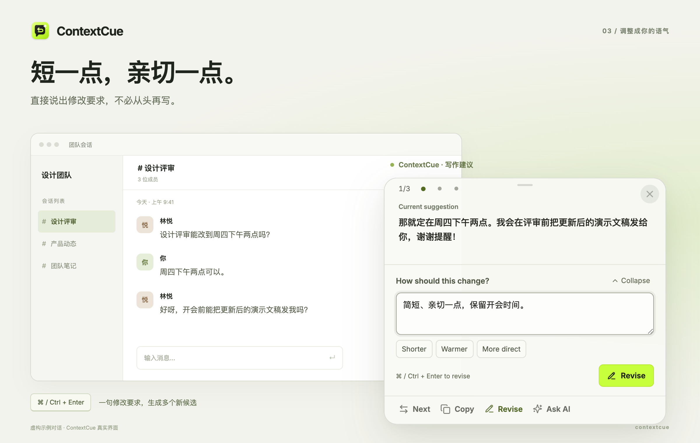
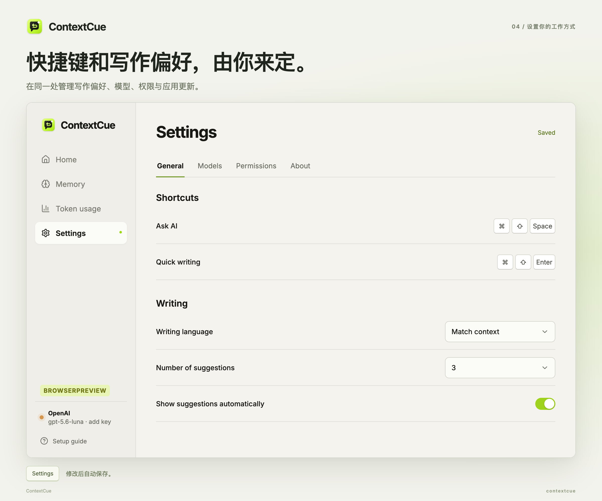

<div align="center">
  
  <h1>ContextCue</h1>
  <p><strong>看懂当前页面，写好下一句话。</strong></p>
  <p>一个轻量浮窗，帮你理解页面、起草回复、调整表达。</p>
  <p>
    <a href="https://github.com/jastfkjg/ContextCue/releases">下载 macOS 版</a>
    · <a href="#快速开始">快速开始</a>
    · <a href="./README.md">English</a>
  </p>
  <p><strong>一个快捷键唤起</strong> · 自选模型服务商 · 由你决定是否发送</p>
</div>



面对需要理解的页面或待回复的消息，按下快捷键打开 **Ask AI**。问“这里需要我做什么？”，或说“帮我婉拒，保留以后合作的机会”。解释直接阅读，写作请求生成可修改、复制或插入的草稿。熟练用户也可以用独立快捷键直接生成写作建议。

## 它能帮你做什么

| 当你想要…… | ContextCue 可以…… |
|---|---|
| **快速理解页面** | 在轻量问答框里总结信息、解释内容、梳理下一步，可选择是否使用页面上下文。 |
| **把意图变成草稿** | 在 Ask AI 中说出想表达什么，写作请求会打开可修改、复制或插入的候选。 |
| **找到合适的语气** | 对照当前草稿填写修改要求，比较不同版本，再返回同一段 Ask AI 问答。 |
| **处理聊天之外的写作** | 起草文案、改写段落、填写字段，或组织搜索词。 |
| **使用自己的模型** | 通过 Responses 或 Chat Completions 接口连接支持图片输入的模型，并保存多个配置。 |
| **掌握使用过程** | 检查后再复制或插入，在本地查看服务商返回的 Token 用量，不自动发送或提交。 |

可从应用或浏览器窗口唤起，无需为每个应用单独接入。macOS 识别到输入框时可直接插入，不支持插入时仍可复制。搜索辅助只生成搜索词，不执行联网搜索。

## 快速开始

### 1. 安装或从源码运行

**macOS：** 打开 [Releases 下载页](https://github.com/jastfkjg/ContextCue/releases)，选择适合 **Apple Silicon（`arm64`）** 或 **Intel（`x64`）** 的 DMG，将 ContextCue 拖入 Applications。签名状态及首次启动方式请查看对应版本说明；早期体验版可能尚未经过 Apple 公证。

**源码运行：** 需要 **Node.js 22.12+** 和 **npm 10+**。

```bash
git clone https://github.com/jastfkjg/ContextCue.git
cd ContextCue
npm install
npm run dev
```

macOS 是目前主要验证的平台。Windows 和 Linux 可从源码运行；Linux 截图需要 X11 与 `xdotool`。跨应用插入目前仅支持 macOS。

### 2. 配置模型

首次打开的 **Setup guide（设置引导）** 会带你添加模型和 API Key、验证图片输入、检查屏幕权限，再用虚构对话体验提问或起草回复。macOS 的辅助功能权限为可选，用于向支持的输入框插入文字。

在 **Settings → Models（模型）** 中管理连接，必填项填写完整后自动保存。写作建议和带页面上下文的问答需要支持**图片输入**的模型；关闭页面上下文后，**Ask AI** 的问答、起草与后续草稿修改也可使用纯文本模型。模型请求（包括首次验证）可能产生服务商费用。[模型与环境变量配置 →](./docs/guide.zh-CN.md#模型服务商)

在 **Settings → Permissions（权限）** 中检查录屏和可选的插入权限。展开 **Test window capture（测试窗口截图）**，开始测试后在三秒内切到目标窗口，再返回设置查看本地预览。

### 3. 打开窗口，按下快捷键

| 操作 | macOS | Windows / Linux |
|---|---|---|
| 打开 Ask AI（主入口） | `⌘ ⇧ Space` | `Ctrl ⇧ Space` |
| 直接生成写作建议 | `⌘ ⇧ Enter` | `Ctrl ⇧ Enter` |
| 发送 Ask AI 问题／输入换行 | `Enter` / `Shift Enter` | `Enter` / `Shift Enter` |
| 切换候选 | `←` / `→` | `←` / `→` |
| 使用当前候选¹ | `Enter` | `Enter` |
| 提交修改要求 | `⌘ Enter` | `Ctrl Enter` |
| 收起输入区或关闭浮窗 | `Esc` | `Esc` |

¹ 在文本输入框之外、且修改输入区收起时生效。macOS 识别到输入框时插入，否则复制，不会发送消息。表格为新安装默认值；升级会保留原有快捷键。快捷键、写作语言和候选数量均可在 **Settings → General（通用）** 中修改。

## 看看实际使用方式

### 从提问走到可用草稿

先问“评审前我还需要做什么？”，再说“帮我写一条友好的回复，确认时间，并说明会在开会前发出文稿”。ContextCue 会在同一个浮窗中打开候选草稿。你可以挑选、修改，也可以返回 **Ask AI** 继续交流；点击 **Open draft（打开草稿）** 即可回到最近一次生成的草稿。



顶部页面标签可切换是否使用截图；刷新按钮会重新截取原窗口并开启新会话，截图成功后才会清除旧问答与草稿。暂时切到其他应用时浮窗会隐藏，回到原窗口后恢复已有内容。[会话与刷新说明 →](./docs/guide.zh-CN.md#工作方式)

### 把建议改成你的语气

点击 **Revise（修改）**，直接描述想怎么改，新候选会在同一个浮窗中出现。可以使用 **Shorter（更简短）**、**Warmer（更亲切）**、**More direct（更直接）**，也可以写自己的要求。草稿与修改输入区各自滚动，方便边看边改。**Collapse（收起）** 只收起修改要求，右上角 **×** 关闭整个浮窗；也可切回原始候选对比。



### 设置你的工作方式

首页集中展示 **Ask AI**、**Quick writing（快捷写作）**，以及模型和屏幕权限状态。设置页分为四个标签：

| 标签 | 可以做什么 |
|---|---|
| **General（通用）** | 录入快捷键、选择写作语言、设置候选数量。 |
| **Models（模型）** | 添加模型连接、测试接口、选择默认模型。 |
| **Permissions（权限）** | 检查录屏与插入权限，测试截图、查看可用窗口。 |
| **About（关于）** | 检查更新、下载新版本。 |



设置修改后自动保存。**Writing language（写作语言）** 控制生成内容的语言，**Match context（匹配上下文）** 会跟随页面语言。侧栏的 **Token usage（用量统计）** 可查看模型用量、每日趋势与最近请求。

## 上下文由你决定

- **主动唤起才截取页面。** 不在后台录屏，重新唤起或点击刷新会获取新的页面快照。
- **使用你选择的服务商。** 请求需要截图和相关文字时，它们会发送到你配置的模型接口。“本地优先”指数据存储方式，模型推理可能在远端进行。
- **配置与记录保存在本机。** 设置、记忆文档和用量记录留在本地；当前页面的建议与问答不读取长期记忆或历史采用回复。API Key 使用操作系统能力加密，整个数据文件尚未加密。
- **文字经你确认再使用。** 复制或插入都需要明确操作，ContextCue 不自动提交表单或发送消息。截图不会自动脱敏。

[完整隐私说明](./docs/guide.zh-CN.md#隐私边界) · [平台与截图限制](./docs/guide.zh-CN.md#当前限制)

## 开发与文档

基于 **Electron、React 和 TypeScript** 构建。

```bash
npm run lint     # TypeScript 检查
npm test         # 单元测试
npm run build    # 构建桌面应用
npm run package  # 生成未打包的应用目录
```

| 继续了解 | 内容 |
|---|---|
| [使用指南](./docs/guide.zh-CN.md) | 首次设置、模型接入、本地记忆、用量统计、技术结构及完整开发命令 |
| [交互流程](./docs/interaction-flows.md) | 会话边界、候选修改与验收步骤（英文） |
| [更新与发布](./docs/updates.md) | 打包、签名和应用内更新 |
| [产品路线](./TODO.md) | 当前重点与计划中的功能 |

ContextCue 仍是早期桌面 MVP。遇到问题或有改进建议，欢迎[提交 Issue](https://github.com/jastfkjg/ContextCue/issues)。
